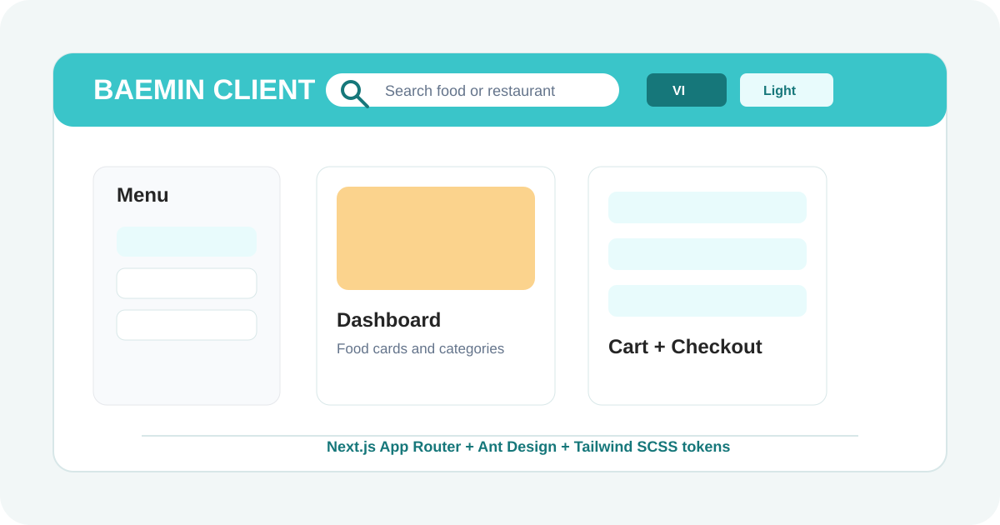
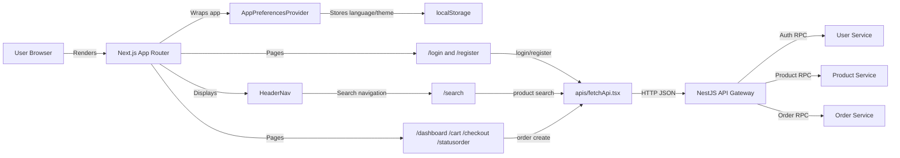

# Baemin Client



Baemin Client is the Next.js App Router web app for browsing food, searching restaurants/products, authenticating users, managing the cart, checking out, and viewing order status. It talks to the NestJS API gateway through the API wrappers in `apis/fetchApi.tsx`.

## Feature Map

- Authentication pages at `/login` and `/register`.
- Dashboard/menu discovery at `/dashboard`.
- Product and restaurant search at `/search`; legacy `/sreach` remains available.
- Cart, checkout, and order status flows at `/cart`, `/checkout`, and `/statusorder`.
- Persistent language switcher for `fr`, `ca`, `es`, `de`, `vi`, and `it`.
- Persistent light/dark theme switcher backed by CSS variables.
- SCSS-backed Tailwind design system in `app/styles`.

## Architecture Diagram

Source Mermaid lives in [`docs/architecture.mmd`](docs/architecture.mmd). Use [$figma:figma-generate-diagram](C:\Users\ACER\.codex\plugins\cache\openai-curated-remote\figma\2.0.16\skills\figma-generate-diagram\SKILL.md) to turn it into an editable FigJam diagram.



## Thumbnail And Icon

- Client thumbnail source: [`docs/thumbnail.svg`](docs/thumbnail.svg).
- Client icon source: [`docs/icon.svg`](docs/icon.svg).
- Runtime app icon: [`public/baemin-icon.svg`](public/baemin-icon.svg).

Use [$figma:figma-generate-design](C:\Users\ACER\.codex\plugins\cache\openai-curated-remote\figma\2.0.16\skills\figma-generate-design\SKILL.md) to recreate/refine the thumbnail and icon in Figma from these code-derived SVG bases. The visual cues come from the app code: Baemin brand color `#3AC5C9`, search/navigation header, cart, checkout, order status, multilingual controls, and the SCSS design-system tokens.

## Design System

The global style entrypoint is [`app/globals.scss`](app/globals.scss).

- `app/styles/_tokens.scss`: brand, light/dark theme variables, radius, shadows, and layout tokens.
- `app/styles/_base.scss`: shared element defaults and Ant Design alignment.
- `app/styles/_components.scss`: reusable `ds-*` classes such as `ds-page`, `ds-container`, `ds-panel`, `ds-card`, `ds-button`, `ds-input`, `ds-badge`, `ds-table`, and `ds-bottom-bar`.
- `app/styles/_utilities.scss`: shared helpers such as `ds-scrollbar-none`, `ds-scroll-x`, `ds-surface`, and `ds-focus-ring`.

Prefer Tailwind utilities for one-off layout and promote repeated patterns into the `ds-*` classes.

## Runtime Configuration

Create `.env.local` when the gateway is not running on the default URL:

```bash
NEXT_PUBLIC_API_URL=http://localhost:8080
```

## Commands

```bash
yarn install
yarn dev
yarn lint
yarn typecheck
yarn test
yarn test:cov
yarn build
```

Run Cypress after the app is available on port `3000`:

```bash
yarn test:e2e
```

## Figma Workflow

1. For the architecture diagram, open [`docs/architecture.mmd`](docs/architecture.mmd) and send the Mermaid source through [$figma:figma-generate-diagram](C:\Users\ACER\.codex\plugins\cache\openai-curated-remote\figma\2.0.16\skills\figma-generate-diagram\SKILL.md).
2. For thumbnail/icon design, use [$figma:figma-generate-design](C:\Users\ACER\.codex\plugins\cache\openai-curated-remote\figma\2.0.16\skills\figma-generate-design\SKILL.md) with the running web app or the SVG files in `docs/`.
3. If replacing icons in Figma, import the SVG source directly instead of redrawing the icon from primitives.
